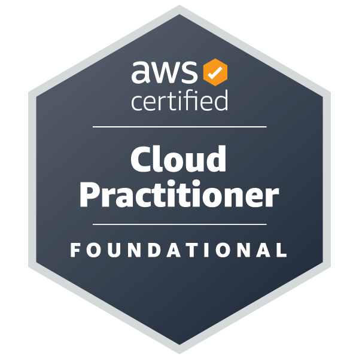

  

  

<h3 align="center">Connect with me:</h3>

  

<h2 align="center">🔥 Languages & Frameworks & Tools & Abilities 🔥</h2>
 
  
<h2 align="center">
  <code></code>
  
   
   
  <code></code>
  <code></code>
  <code></code>
  <code></code>
  <code></code>
  <code></code>
  <code></code>
  <code></code>
  
</h2>
